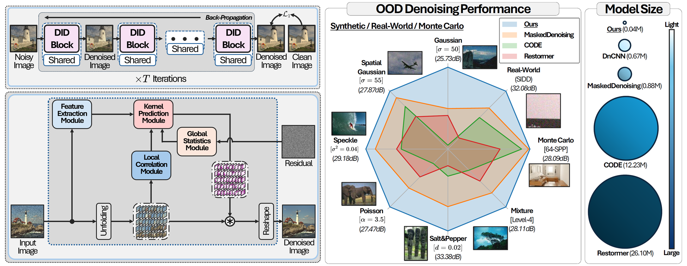

<div align="center">

<h1>IDF: Iterative Dynamic Filtering Networks <br>for Generalizable Image Denoising</h1>
<h4>
  <a href="https://scholar.google.com/citations?user=6I9aJxYAAAAJ">Dongjin Kim</a>*,
  <a href="https://scholar.google.com/citations?user=NBs5cTMAAAAJ">Jaekyun Ko</a>*,
  <a href="https://scholar.google.com/citations?user=FW4ylx4AAAAJ&hl">Muhammad Kashif Ali</a>,
  <a href="https://sites.google.com/view/lliger9/team/taehyunkim">Tae Hyun Kim<sup>&#8224;</sup></a>
</h4>

<b><sub><sup>* Equal contribution.  <sup>&#8224;</sup> Corresponding author.</sup></sub></b>

[](https://arxiv.org/abs/2508.19649)
&nbsp;
[](https://dongjinkim9.github.io/projects/idf)
&nbsp;
[](https://huggingface.co/spaces/dongjin-kim/IDF)
&nbsp;
[](https://colab.research.google.com/drive/1bzhrkVPS8iiOZy1fANJIOu15C2obN5B2?usp=sharing)

</div>

---
<div align="center">





<i>We introduce a compact iterative dynamic filtering (IDF) framework for image denoising that predicts pixel-adaptive denoising kernels. Even though IDF is trained with extremely limited data (e.g., a single-level Gaussian noise), it generalizes effectively to diverse unseen noise types and levels with only ~0.04M parameters.</i>

</div>


## 📦 Installation

```bash
git clone https://github.com/dongjinkim9/IDF.git
cd IDF
pip install -r requirements.txt
```

## 🚀 Demo
You can try IDF in several ways:

- Hugging Face: [](https://huggingface.co/spaces/dongjin-kim/IDF)

- Colab: [](https://colab.research.google.com/drive/1bzhrkVPS8iiOZy1fANJIOu15C2obN5B2?usp=sharing)

- Local (Python script):
```bash
python demo.py
```

## 📁 Dataset Preparation

| Dataset Type | Dataset | 
| :----------: | :-----: | 
| Training | [CBSD432](https://1drv.ms/u/c/85cf5b7f538e2007/EesZ9Nla6TtKu3OWLAYyGSgBACy4TQknv182VItfCJaiog?e=1yMRXg) |
| Testing (Synthetic Noise) | [CBSD68](https://1drv.ms/u/c/85cf5b7f538e2007/Edi08ncJaiRBouqE0EZ8OCYBWp7N4_QBgQAb1bm6-hxlvw?e=eERlUP) |
|  | [McMaster](https://1drv.ms/u/c/85cf5b7f538e2007/EdZoZMBzjDdDpBvHzzv-X-MBXuHRXEqNuLwUfk-PlMGI_A?e=fOc4tp) |
|  | [Kodak24](https://1drv.ms/u/c/85cf5b7f538e2007/ETnh1pflgaRMhgWnMRqM7OYB5SwVMOCXxKIwHWEqn8NmiA?e=8YwM6k) |
|  | [Urban100](https://1drv.ms/u/c/85cf5b7f538e2007/EV7BHonfGodEkQBsbwOBfQ4B7f7a3LMTxjvSeE7eE-OxMQ?e=vUOSqe) |
| Testing (Real-World Noise) | [SIDD](https://1drv.ms/u/c/85cf5b7f538e2007/EYg_FNX8c5hIlDeDK2b7aIEB-zkiGf022slBJWvw4Myjyw?e=BcxWtr) |
|  | [SIDD+](https://1drv.ms/u/c/85cf5b7f538e2007/EXGdp_Wn1qZBq5nZ9Lc8NZEBii09SchrrgmSxzeId6cczQ?e=lelbjO) |
|  | [PolyU](https://1drv.ms/u/c/85cf5b7f538e2007/EaCxNXRsavZEh79CFwyC7rEBNoAASAuA16klMuZeebXHhw?e=7QTrh4) |
|  | [Nam](https://1drv.ms/u/c/85cf5b7f538e2007/EXf56ksunP5NsBih14mMyGoBpOtXe88mdziFFJ6KC3dnaQ?e=IY1HXt) |
|  | [MonteCarlo](https://1drv.ms/u/c/85cf5b7f538e2007/EfxEnzV1HmpGgQAmLLGY1SoBU2SUf-8Bb6nA-2okV5i6oQ?e=Hv12eO) |

1. Download datasets individually from the table above, or download the full bundled [dataset package](https://1drv.ms/u/c/85cf5b7f538e2007/EUzkmWCpnMZNsG7GFsRKDu8B6r2iZhD69hdvEcs9g1Popw?e=83lxhL).

2. After downloading, set the dataset root path (`dataroot`) in the dataset configuration YAML files located in `configs/datasets`.
```
dataset:
  target: idf.datasets.gaussian.GaussianDataset
  params:
    dataroot: {dataset_root_path}/{train|test}/{dataset_name}
```
---
## 🏋️ Training & Evaluation
### A. Train IDF
```
python main.py --config configs/train_lit_denoising.yaml
```

### B. Validation / Testing
```
python main.py --config configs/test_lit_denoising.yaml
```

### C. Reproducing Results
1. Pretrained checkpoints are available in the `pretrained_models` directory.
2. To evaluate a pretrained model:
```
python main.py --config configs/test_lit_denoising.yaml
```

### D. Configuration Details
For detailed options related to training, datasets, and the model settings, please refer to:

* **Training / Testing:** `configs/{train|test}_lit_denoising.yaml`
* **Datasets:**
  * Training: `configs/datasets/train/gaussian.yaml`
  * Testing: `configs/datasets/test/synthetic.yaml`
* **Model:** `configs/models/idfnet.yaml`

## 🎇 Results
Full qualitative comparisons are available on the project page: 
[](https://dongjinkim9.github.io/projects/idf)

### 🧪 Synthetic Noise
<p align="center">
  
</p>

### 🌏 Real-World Noise
<p align="center">
  
</p>

## 📚 Citation
If you use this code or find it helpful, please cite:

```bibtex
@inproceedings{kim2025idf,
    title={IDF: Iterative Dynamic Filtering Networks for Generalizable Image Denoising},
    author={Kim, Dongjin and Ko, Jaekyun and Ali, Muhammad Kashif and Kim, Tae Hyun},
    booktitle={Proceedings of the IEEE/CVF International Conference on Computer Vision},
    year={2025}
}
```
